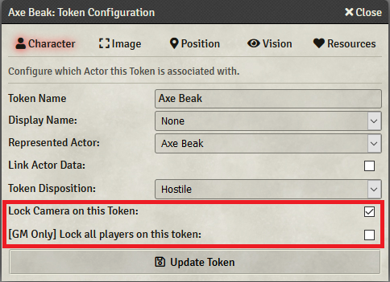

# camera-follow-token
A module for FoundryVTT. Adds a checkbox to the Token configuration window which sets the camera to follow that token. GM is given an extra option to make all players' cameras follow. on the token. 
Due to using the Token Configuration window, players will need to have permissions for 'Configure Token Settings' to use this module independently of the GM. 

